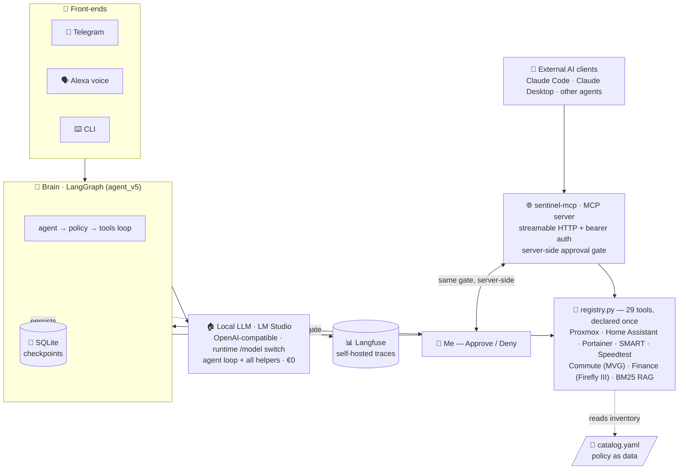
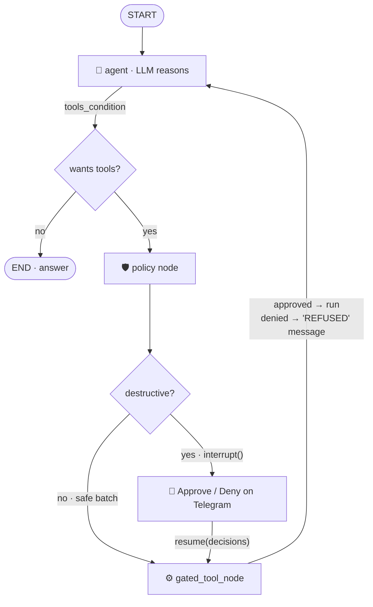
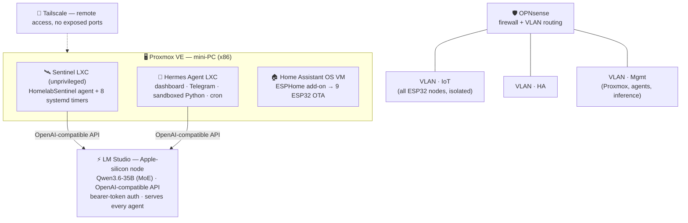
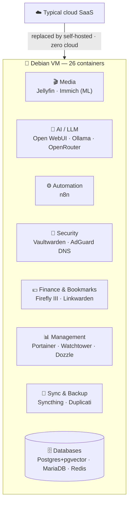
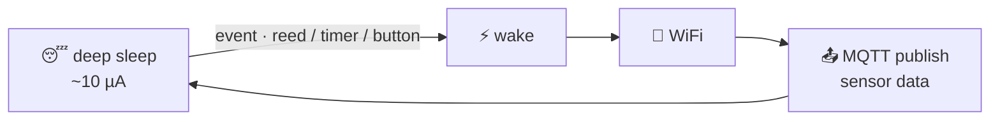
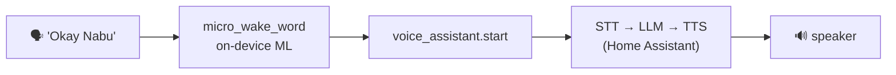

<div align="center">


*I build **production agentic-AI systems** — LangGraph agents with human-approval gates, an **MCP server**, a golden **eval harness with CI**, 100% local LLM serving, and the reliability engineering to keep them running 24/7 — on top of an embedded/IoT hardware background that keeps me grounded in real systems.*

**AI / Agents** ·


**Systems / Hardware** ·


📍 Germany  ·  ✉️ naveen6gowda@gmail.com  ·  🛰️ Flagship: **[HomelabSentinel agent ↗](https://github.com/naveen6gowda/AI-Agent)**

</div>

---

This repository is my hands-on portfolio across **agentic AI / LLM application
development**, **local AI infrastructure**, and **embedded / home-automation**
projects built with real hardware and deployed in a production home environment.
Every project here runs 24/7 and was designed, debugged, and refined through
real-world use — not a tutorial follow-along.

## 🆕 What's new — July 2026

The flagship agent, **[HomelabSentinel ↗](https://github.com/naveen6gowda/AI-Agent)**, just completed its **entire architecture roadmap** — every phase from the honest architecture review is now shipped and running in production:

- 🧬 **LLM fine-tuning, end to end and 100% local** *(newest)* — built a **1,600-pair bilingual instruction dataset** from my own infrastructure docs, then ran **two training regimes** on a 24 GB MacBook with MLX: a **QLoRA fine-tune of Qwen3.5-9B** (rank-8 adapters on a 4-bit base) and a **full-parameter fine-tune of Qwen3.5-2B** (bf16, gradient checkpointing). The fused model (`qwen3.5-9b-navi-lora`) is deployed into the same LM Studio service that powers the agents. Full writeup: [`ai/finetuning/`](./ai/finetuning/).
- 🌐 **`sentinel-mcp` — a production MCP server.** The agent's whole tool registry (29 tools) is now served to any MCP client — Claude Code, Claude Desktop, other agents — over **streamable HTTP with bearer auth**. The human-approval gate is enforced **server-side**: a destructive call from an external AI still lands as an Approve/Deny card on my phone, **default-deny on timeout**. External models get the same safety rails I do.
- 🧪 **A scripted evaluation harness** — 12 golden scenarios replay real operational questions against the live agent and score tool selection + final answers. It has already paid for itself: it caught an over-quantized model variant silently degrading tool-call ordering — now tracked as an explicit `known_fail` with the analysis written down. **Evals as regression tests for agent behavior.**
- ✅ **A real test suite + CI** — 40+ pytest tests (policy gate, MCP auth, tool clients, eval plumbing), including a regression test for a default-deny bug the suite itself surfaced. Green on GitHub Actions on every push.
- 🧰 **One tool registry** ([`registry.py` ↗](https://github.com/naveen6gowda/AI-Agent/blob/main/Agent_AI/registry.py)) — every tool declared once with its metadata; the LangGraph agent, the MCP server, and the policy gate all consume the same source of truth. Policy itself lives in `catalog.yaml` — **policy as data, not code**.
- 🔒 **A sanitizing public-mirror pipeline** — the private repo is scrubbed and secret-scanned before every push to the public mirror. The scanner has already **caught a real `.env.bak` before it went public** — security tooling that earned its keep.
- 🛡️ **Resilience upgrades** — an LLM fallback chain (if the primary local model is unavailable, the agent degrades gracefully instead of dying) and **memory-before-prune**: conversation history is distilled into RAG-searchable notes before checkpoint retention deletes it.
- **Still 100% local** — one model served by LM Studio (OpenAI-compatible) powers the agent loop *and* every helper at **€0** marginal cost, with runtime `/model` switching guarded by a probe-before-switch check; every run traced in **self-hosted Langfuse**; every systemd unit pages me on failure via `OnFailure=` hooks.

**Related repositories**
| Repo | What |
|---|---|
| 🛰️ [`AI-Agent`](https://github.com/naveen6gowda/AI-Agent) | **HomelabSentinel** — my agentic-AI homelab SRE (LangGraph + human-approval gate + 100% local LLM). Full source. |
| 🧪 [`ai/`](./ai/) | LangChain / LangGraph chains, tool-use loops, and structured-output examples (in this repo) |
| 🔌 [`pcb/`](./pcb/) | PCB designs — CM5 carrier, mains-rated relay controller (KiCad; writeups in this repo) |

---

## 👤 About

Engineer focused on **agentic AI systems** — LangGraph / LangChain application
development, human-in-the-loop safety, local LLM serving, and LLM observability —
built on a foundation of embedded systems and IoT hardware. My work spans the
whole stack:

- 🛰️ **AI agents for real systems** — an SRE agent that reads Proxmox + Home Assistant state through tools and *acts* on it, behind a default-deny human-approval gate
- 🤖 **AI / LLM applications** — LangChain & LangGraph for chains, structured output, tool use, and graph-based agents; Pydantic-typed everything
- 📊 **LLM observability & reliability** — self-hosted Langfuse tracing, failure pagers on every unit, deterministic fallbacks so monitors never go silent
- 🧠 **Local AI infrastructure** — self-hosted, OpenAI-compatible LLM serving (LM Studio today; llama.cpp and Ollama in earlier generations) with zero cloud dependency
- 🔌 **PCB design** (KiCad) — schematic → routed board → 3D-rendered production layout
- 📡 **ESP32 firmware** (ESPHome / C++) — 9 production devices, deep-sleep & battery-optimized
- 🏠 **Home automation** — Home Assistant via MQTT and native API
- 🐧 **Linux systems & networking** — Proxmox, LXC, Docker, VLANs, OPNsense

---

## 🧭 Project Overview

| # | Project | Stack | Highlights |
|:--:|---------|-------|-----------|
| **1** | [AI Agents](#1-ai-agents) | Python · LangGraph · MCP · local LLM | **HomelabSentinel** — agentic SRE with a human-approval gate, an MCP server, a golden eval harness + CI, 100% local inference, Langfuse tracing |
| **1b** | [LLM Fine-Tuning](./ai/finetuning/) | MLX · mlx-lm · LoRA/QLoRA · full FT | Qwen3.5-9B QLoRA + Qwen3.5-2B full fine-tune on a 24 GB MacBook, 1,600-pair self-curated dataset, fused model deployed to LM Studio |
| **2** | [AI Homelab Infrastructure](#2-ai-homelab-infrastructure) | Proxmox · LXC · LM Studio | Self-hosted OpenAI-compatible LLM serving — the platform every agent runs on |
| **3** | [Docker Self-Hosted Stack](#3-docker-self-hosted-stack) | Debian · 26 containers | Immich ML, n8n, Vaultwarden, Open WebUI — zero cloud |
| **4** | [PCB Design](#4-pcb-design) | KiCad | CM5 carrier (Hailo-8, M.2) + mains-rated relay controller |
| **5** | [ESPHome Firmware & IoT Devices](#5-esphome-firmware--iot-devices) | 9× ESP32 | Deep-sleep sensors, wake-word voice, radar presence, touch panels |

---

## 1. AI Agents

> 🛰️ **LangChain · LangGraph · tool use · human-in-the-loop safety — from a raw tool-loop to a production agent that runs my homelab.**

**In this repo:** [`ai/`](./ai/)  ·  **Flagship (full source):** [`AI-Agent ↗`](https://github.com/naveen6gowda/AI-Agent)

### ⭐ Featured — HomelabSentinel: an agentic-AI SRE

An autonomous Site-Reliability agent that watches **Proxmox + Home Assistant +
Docker**, reasons about what's wrong with an LLM, and **asks my permission on
Telegram before it changes anything.** It runs 24/7 on an unprivileged LXC,
answers over **Telegram and Alexa** — and since the July 2026 redesign, every
token of inference is **100% local**.



**The safety model — every destructive action stops at a human gate:**



- 🛡️ **Human-in-the-loop safety** — a LangGraph `interrupt()` gate pauses every destructive action for my tap (default-deny), backed by **8 layers of defense in depth**.
- 🏠 **100% local LLM** — one model (LM Studio, OpenAI-compatible) powers the agent loop *and* every helper at **€0 marginal cost**; runtime `/model` switching with a probe-before-switch that refuses any model the server can't actually run.
- 📊 **Observability** — every run, tool call, and token count lands in **self-hosted Langfuse**; traces stay home.
- 🚨 **The watcher is watched** — `OnFailure=` Telegram pager on every systemd unit + nightly checkpoint-DB retention (learned the hard way at 274 MB). Every monitor has a deterministic fallback, so it **never goes silent** if the LLM is down.
- 🌐 **MCP server (`sentinel-mcp`)** — the same 29-tool registry is served to any MCP client (Claude Code / Desktop, other agents) over streamable HTTP + bearer auth, with the approval gate enforced **server-side**: an external AI's destructive call still needs my tap on Telegram, default-deny on timeout.
- 🧪 **Evaluated, not vibed** — a 12-scenario golden eval harness scores tool selection and answers on every change, plus **40+ pytest tests on GitHub Actions CI**. The evals caught a quantization-induced tool-ordering regression that manual testing missed.
- 🔌 **Production surface** — Telegram bot, Alexa voice bridge (read-only *by construction*), BM25 RAG over my runbooks, and **8 systemd timers**: reachability, Docker, SMART, WAN speed, backups, energy, an **MVG commute guard**, and a **finance bridge** into Firefly III.
- 📈 **Built in five explicit versions** — `agent_v1` (raw ReAct loop, zero frameworks) → `agent_v5` (approval gate + SQLite checkpointer + token economy), now archived in [`legacy/` ↗](https://github.com/naveen6gowda/AI-Agent/tree/main/Agent_AI/legacy) with a file-by-file teaching guide.
- 📐 **Roadmap: shipped** — the honest [architecture review ↗](https://github.com/naveen6gowda/AI-Agent/blob/main/Agent_AI/docs/ARCHITECTURE.md) laid out three phases — one tool registry → an MCP server → a scripted eval harness — and **all three are now in production**, plus a sanitizing mirror pipeline that secret-scans every public push (it caught a real `.env.bak`).

👉 **Full source, the complete architecture, and a file-by-file teaching guide:**
**[github.com/naveen6gowda/AI-Agent ↗](https://github.com/naveen6gowda/AI-Agent)**

### 🧱 Foundations — single concepts, runnable in isolation ([`ai/`](./ai/))

- **LangChain Expression Language (LCEL)** — prompt → model → output-parser chains
- **Structured output with Pydantic** — typed, validated LLM responses (ratings, enums, nested models)
- **Tool use with the raw provider SDK** — a multi-turn tool-calling loop with `tool_use` / `tool_result` blocks, no framework
- **LangGraph (prebuilt + custom)** — `create_react_agent` and a hand-built `StateGraph` with `ToolNode` / `tools_condition`
- **Real-data analytics** — Open-Meteo weather pull → pandas DataFrame → matplotlib chart

**Stack:** Python · LangChain · LangGraph · Anthropic SDK · Pydantic · `python-dotenv` · pandas · matplotlib · **LM Studio** (current local inference target, OpenAI-compatible) · llama.cpp and Ollama (earlier generations)

### 🧬 LLM Fine-Tuning — LoRA/QLoRA + full fine-tune, 100% local ([`ai/finetuning/`](./ai/finetuning/))

Beyond *using* models: **training them**. On a 24 GB MacBook with MLX / `mlx-lm`, I fine-tuned Qwen3.5 to answer questions about my own infrastructure the way I would:

- **Dataset engineering first** — 1,600 self-curated instruction pairs across 20 topic domains (bilingual EN/DE, deliberate paraphrase variety for generalization), verified secret-free by an automated scan, with a disciplined 1,440/160 train/val split plus a held-out test set to catch catastrophic forgetting.
- **Two regimes on the same data** — a **QLoRA fine-tune of Qwen3.5-9B** (rank-8 adapters on a 4-bit base, 13 of 32 blocks) and a **full-parameter fine-tune of Qwen3.5-2B** (bf16, 16 of 24 blocks unfrozen, gradient checkpointing) — chosen from the actual memory math of 24 GB unified memory.
- **Deployed, not left in a notebook** — the adapter was fused into a standalone model (`qwen3.5-9b-navi-lora`) and serves from the same OpenAI-compatible LM Studio endpoint the production agents use.

👉 Full writeup with pipeline diagram and configs: [`ai/finetuning/`](./ai/finetuning/)

---

## 2. AI Homelab Infrastructure

> 🧠 **Self-hosted local LLM serving — no cloud, no subscription, full control. The platform every agent above runs on.**

**Directory:** [`homelab/`](./homelab/)



- **Proxmox VE** hypervisor on a mini-PC (x86, 4-core, 16 GB RAM) hosting the agent platforms: the **Sentinel LXC** (HomelabSentinel + its monitor timers) and the **Hermes Agent** container (web dashboard, Telegram, sandboxed Python execution, scheduled jobs).
- **Local inference, third generation** — an Apple-silicon node running **LM Studio** serves a **35B-parameter MoE model (Qwen3.6-35B-A3B)** through an OpenAI-compatible API with bearer-token auth to every agent in the lab. *Earlier generations on the Proxmox iGPU: llama.cpp (Vulkan), and before that Ollama — kept documented because the migration path matters.*
- **Home Assistant OS** VM with the ESPHome add-on managing all ESP32 devices OTA
- **OPNsense** firewall with VLAN segmentation (IoT / HA / Management) + **Tailscale** for remote access with no exposed ports

**Why self-hosted:** privacy (no prompt, trace, or token leaves home), zero
latency, no API costs — and it forced me to learn model serving, auth, and
reliability engineering first-hand instead of renting them from an API.

---

## 3. Docker Self-Hosted Stack

> 🐳 **26 containers on a Debian VM — privacy-respecting, locally-controlled alternatives to cloud services.**

**Directory:** [`docker/`](./docker/)



**Highlights:** zero cloud dependencies · Immich on-device CLIP search + face recognition · Open WebUI bridges local Ollama with an OpenRouter fallback · n8n automations across HA & Immich · Watchtower auto-updates · **Firefly III is the target of the Sentinel finance bridge above**. Full compose (secrets removed): [`docker/`](./docker/).

---

## 4. PCB Design

> 🔌 **Two custom boards in KiCad — schematic → routed PCB → 3D render → production.**

**Directory:** [`pcb/`](./pcb/) — design writeups; KiCad sources available on request.

### 4a · CM5 Minima REV3 — Raspberry Pi CM5 carrier

A compact carrier board for the **Raspberry Pi Compute Module 5**, based on an
open-source CM5 Minima design and **extended with an ESP32-C6-MINI-1 Zigbee/Thread
module** for wireless connectivity.

> **Attribution:** derivative of an open-source CM5 carrier design — my contribution
> was integrating/modifying it to accommodate the ESP32-C6 Zigbee/Thread module.

- 🧠 **Hailo-8 M.2 M-key slot** — 8 TOPS AI accelerator for on-device inference
- 💾 **M.2 B-key 2230** NVMe SSD slot · **RJ45 Gigabit** with magnetics · **USB 3.0** (stacked)
- 📷 DSI + CSI camera interfaces · onboard **SHTC3** temp/humidity · 4× M2.5 mounts for a CNC enclosure
- Deliverables: routed `.kicad_pcb` (DRC-clean), custom footprint library, custom 3D models, Blender renders, CNC enclosure `.step`, PDF schematic

### 4b · ESP32-C6 Relay Controller — mains-rated, 2-channel

The custom board behind the relay-switch automations in the ESPHome projects below.

- ⚡ **2-channel relay** (mains-rated, 10 A / channel)
- 🛡️ **Optocoupler isolation** between ESP32-C6 logic and relay coils — protects the MCU from mains transients
- 🔌 Onboard **HLK-PM01** mains-to-5V — single mains input, no external PSU
- **ESP32-C6-MINI-1** used directly (onboard regulation, no external LDO) · status LED per channel · screw terminals

---

## 5. ESPHome Firmware & IoT Devices

> 📡 **9 ESP32 devices, all on an isolated IoT VLAN, all integrated with Home Assistant.**

**Directory:** [`esphome/`](./esphome/) — YAML configs (credentials replaced with `secrets.yaml` placeholders).

| Device | MCU | Hardware | Standout engineering |
|--------|-----|----------|----------------------|
| 📬 **Mailbox Alert** | ESP32-C6 SuperMini | Reed switch · AHT21 · battery ADC | `ext1` deep-sleep wake · MQTT fire-and-forget · crash-guard @ priority 800 |
| 🌱 **Plant Moisture** | ESP32-C3 | Capacitive soil · SSD1306 OLED | Dual wake (timer + button) · median ADC filter · OLED hardware sleep |
| 🕐 **Hall Clock + Presence** | ESP32-C3 | LD2410C 24 GHz radar · BME280 · OLED | mmWave presence/distance · MDI weather icons · dual time source |
| 🗣️ **Touch Voice Assistant** | ESP32-S3 (16 MB + PSRAM) | 3.5" TFT touch · I2S mic + DAC · AHT20 · ENS160 | On-device wake word ("Okay Nabu") · local voice assistant · multi-page UI |
| 🌡️ **Room Monitors ×3** | ESP32-C3 | BME280 / AHT20 · ENS160 AQI · OLED | Sliding-window average · watchdog auto-restart · presence-aware dimming · CO₂ compensation |
| 🍳 **Kitchen Display** | ESP32-S3 | 3.5" TFT · GT911 touch | Relay control · washer / mailbox alerts · RTC day counter · safe-mode OTA |
| 📄 **E-Paper Panel** | ESP32-C3 | E-ink module | Zero-power image persistence · ESP-IDF low-power |

### 🔧 Engineering patterns across the fleet

- 🔋 **Deep-sleep + battery optimization** — crash guards (sleep before WiFi on a crash loop), sleep sequencing, brownout prevention (15 dBm TX cap)
- 📡 **MQTT fire-and-forget + native-API auto-discovery** — resilient to brief HA outages, entities appear automatically
- 🔄 **OTA without physical access** — a "prevent deep sleep" HA toggle + safe-mode recovery that survives a bad flash
- 🐕 **Watchdogs + dual time source** (HA primary, SNTP fallback) for reliability behind thick walls
- 📋 **Spec-driven development** (GitHub Spec Kit) for the mailbox firmware — structured specs before implementation





---

## 🧰 Skills Demonstrated

| Skill | Evidence |
|-------|----------|
| **AI-agent architectures** | **HomelabSentinel** — LangGraph agent with a human-in-the-loop `interrupt()` approval gate over Proxmox + HA + Docker — [full code ↗](https://github.com/naveen6gowda/AI-Agent) |
| **MCP (Model Context Protocol)** | **`sentinel-mcp`** — production MCP server exposing a 29-tool registry over streamable HTTP + bearer auth, with **server-side human-approval enforcement** (default-deny) — [`mcp_server.py` ↗](https://github.com/naveen6gowda/AI-Agent/blob/main/Agent_AI/mcp_server.py) |
| **Agent evaluation** | 12-scenario golden eval harness scoring tool selection + answers; caught a real quantization regression, tracked as `known_fail` — [`evals/` ↗](https://github.com/naveen6gowda/AI-Agent/tree/main/Agent_AI/evals) |
| **Testing & CI** | 40+ pytest tests (policy gate, MCP auth, clients) green on GitHub Actions on every push — [`tests/` ↗](https://github.com/naveen6gowda/AI-Agent/tree/main/Agent_AI/tests) |
| **LLM application development** | LangChain & LangGraph chains, structured output, LCEL, ReAct agents — [`ai/`](./ai/) |
| **LLM fine-tuning (LoRA/QLoRA + full-parameter)** | Qwen3.5-9B QLoRA (rank 8, 4-bit base) **and** Qwen3.5-2B full fine-tune (bf16, gradient checkpointing) with MLX on a 24 GB MacBook; fused model deployed to the LM Studio serving endpoint — [`ai/finetuning/`](./ai/finetuning/) |
| **Training-data engineering** | 1,600-pair bilingual instruction dataset built from my own docs — 20 topic domains, paraphrase variety, automated secret-scan verification, train/val/held-out-test hygiene — [`ai/finetuning/`](./ai/finetuning/) |
| **Local LLM serving** | LM Studio (OpenAI-compatible + bearer auth) as the single inference target; runtime model switching with probe-before-switch; earlier generations on llama.cpp (Vulkan iGPU) and Ollama |
| **LLM observability** | Self-hosted **Langfuse** — every agent run, tool call, and token count traced, on-prem |
| **Agent reliability engineering** | `OnFailure=` failure pagers on every unit, nightly checkpoint retention, default-deny approval gates, deterministic monitor fallbacks — the agent never fails silently |
| **RAG** | BM25 lexical retrieval over operational runbooks, fully offline; conversation memory distilled into RAG before checkpoint pruning — [in AI-Agent ↗](https://github.com/naveen6gowda/AI-Agent) |
| **Secure open-sourcing** | Private repo → sanitizing pipeline (scrub + secret scan) → public mirror; the scanner caught a real `.env.bak` before it went public |
| **Structured LLM output** | Pydantic-typed responses, validation, enum constraints — [`ai/structure_io.py`](./ai/structure_io.py) |
| **PCB design (KiCad)** | CM5 carrier (extended w/ ESP32-C6 Zigbee/Thread), mains-rated relay controller — schematic to production — [`pcb/`](./pcb/) |
| **ESP32 firmware (ESPHome / C++)** | 9 production devices — deep sleep, ADC, I2C, SPI, UART, I2S — [`esphome/`](./esphome/) |
| **MQTT protocol** | Fire-and-forget, retained topics, HA auto-discovery |
| **Battery optimization** | Crash guards, deep-sleep sequencing, display power management |
| **Docker (self-hosted)** | 26-container compose stack — Immich, n8n, Jellyfin, Vaultwarden, Firefly III, Watchtower — [`docker/`](./docker/) |
| **Home Assistant integration** | 9 ESPHome nodes, MQTT, native API, automations, voice |
| **Linux & networking** | Proxmox, LXC, VLANs, systemd, Debian, OPNsense, Tailscale, AdGuard DNS |

---

## 🗂️ Repository Structure

```
Portfolio/
├── README.md                 ← you are here
├── ai/                       ← LangChain / LangGraph examples + agent showcase
│   ├── README.md
│   ├── LCEL.py · structure_io.py · tools.py · custom_langraph.py · …
│   ├── ollama-lxc-setup.md
│   ├── finetuning/           ← Qwen3.5 LoRA/QLoRA + full fine-tune writeup (MLX)
│   └── Agent_AI/             ← HomelabSentinel showcase (full code → AI-Agent)
├── homelab/                  ← infrastructure docs
│   └── infrastructure.md
├── docker/                   ← 26-container compose stack (secrets removed)
│   ├── README.md
│   └── docker-compose.yml
├── esphome/                  ← 9 ESP32 device configs (secrets removed)
│   ├── mailbox-alert.yaml · plant-moisture.yaml · hall-clock.yaml
│   ├── touch-voice-assistant.yaml · kitchen-display.yaml · epaper.yaml
│   └── bathroom-monitor.yaml · livingroom-monitor.yaml · office-monitor.yaml
└── pcb/                      ← PCB design writeups (KiCad)
    └── README.md
```

---

## 📬 Contact

- ✉️ **Email:** naveen6gowda@gmail.com
- 🐙 **GitHub:** [github.com/naveen6gowda](https://github.com/naveen6gowda)
- 🛰️ **Flagship project:** [HomelabSentinel — AI-Agent ↗](https://github.com/naveen6gowda/AI-Agent)
- 📍 **Location:** Germany

---

<div align="center">

*All projects here are real, deployed, and actively maintained. ESPHome YAML files
have WiFi credentials and API keys replaced with placeholders — use a `secrets.yaml`
in production. Built with AI assistance; the designs, decisions, and deployments are mine.*

</div>
