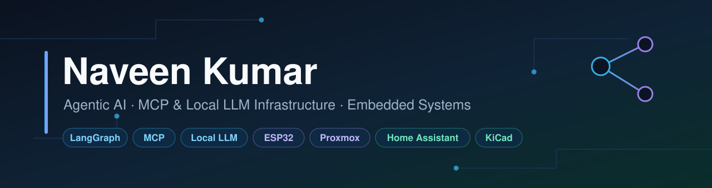
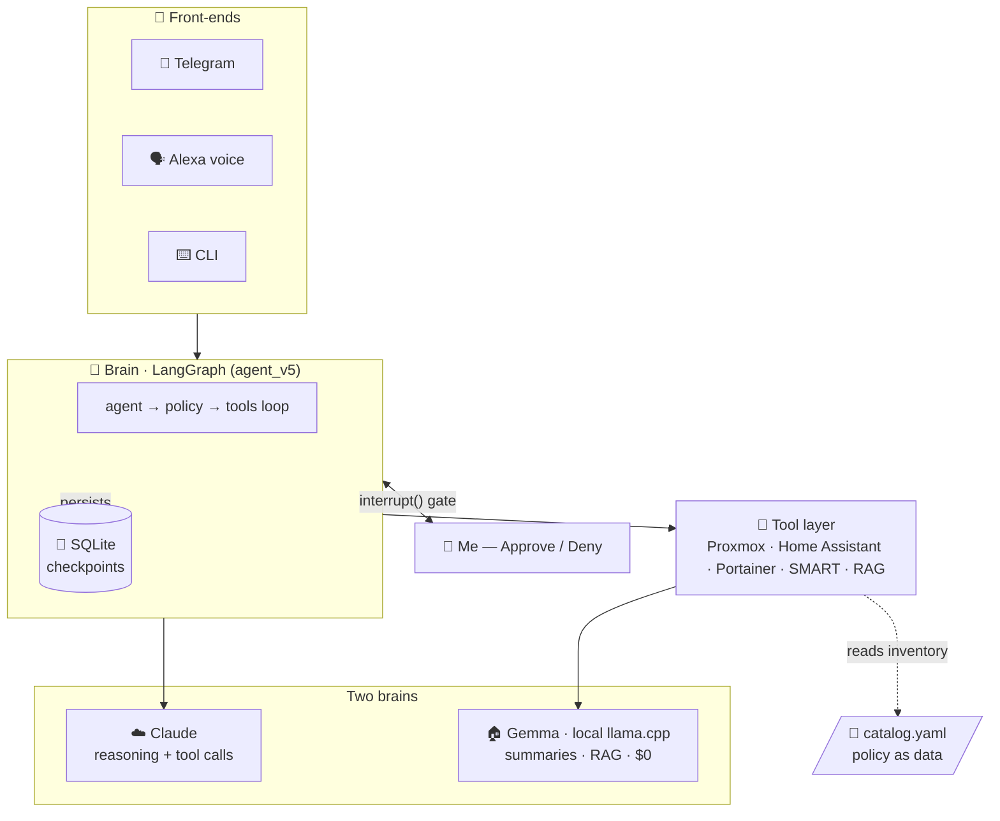
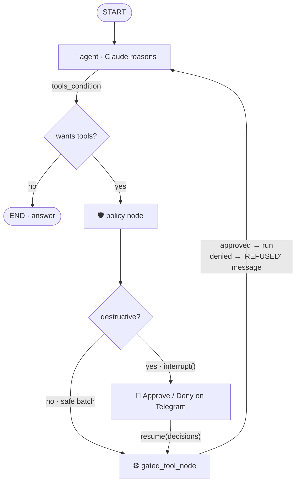
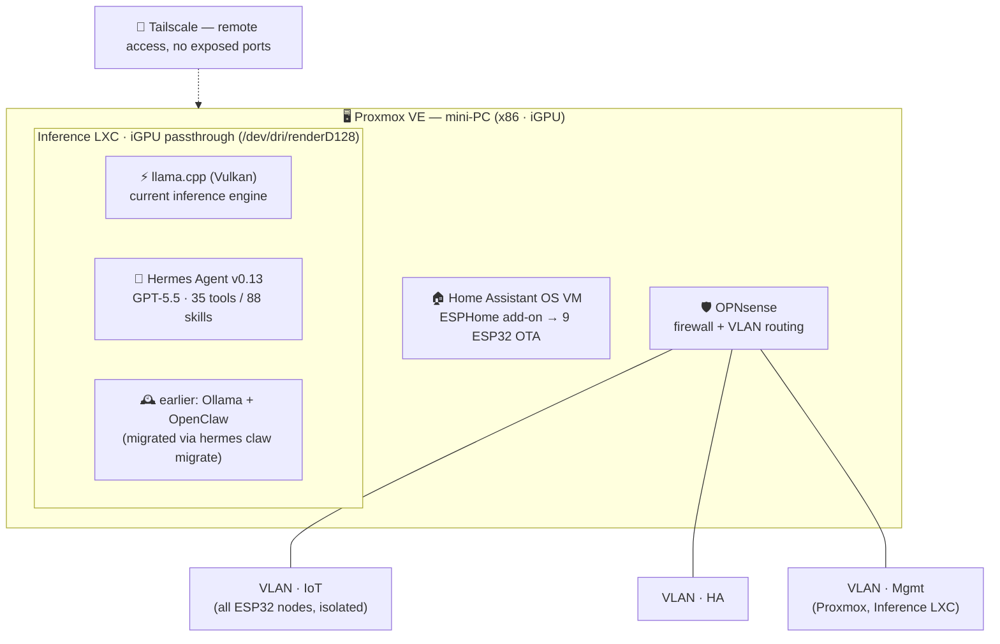
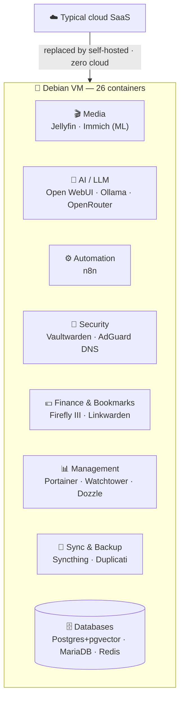
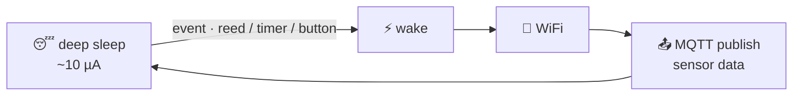
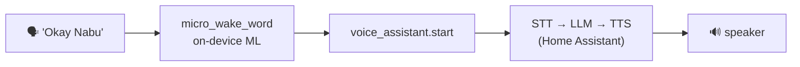

<div align="center">



*Agentic AI · local LLM infrastructure · ESP32 firmware · PCB design — all designed, deployed, and running 24/7 in a production homelab.*


📍 Germany  ·  ✉️ naveen6gowda@gmail.com  ·  🛰️ Flagship: **[HomelabSentinel agent ↗](https://github.com/naveen6gowda/AI-Agent)**

</div>

---

This repository is my hands-on portfolio across **AI / LLM application development**,
**local AI infrastructure**, and **embedded / home-automation** projects built with
real hardware and deployed in a production home environment. Every project here runs
24/7 and was designed, debugged, and refined through real-world use — not a tutorial
follow-along.

**Related repositories**
| Repo | What |
|---|---|
| 🛰️ [`AI-Agent`](https://github.com/naveen6gowda/AI-Agent) | **HomelabSentinel** — my agentic-AI homelab SRE (LangGraph + human-approval gate). Full source. |
| 🧪 [`ai/`](./ai/) | LangChain / LangGraph chains, tool-use loops, and structured-output examples (in this repo) |
| 🔌 [`KiCad-projects`](https://github.com/naveen6gowda/KiCad-projects) | PCB designs — CM5 carrier, relay controller |

---

## 👤 About

Embedded systems engineer with a strong hands-on focus on **AI / LLMs** — local
inference, LangChain / LangGraph application development, and AI-agent workflows —
on top of a background in IoT and embedded hardware. My work spans the whole stack:

- 🤖 **AI / LLM applications** — LangChain & LangGraph for chains, structured output, tool use, and graph-based agents
- 🛰️ **AI agents for real systems** — an SRE agent that reads Proxmox + Home Assistant state through tools and *acts* on it, safely
- 🧠 **Local AI infrastructure** — self-hosted LLM inference on Proxmox with iGPU passthrough (llama.cpp + Hermes; earlier Ollama + OpenClaw)
- 🔌 **PCB design** (KiCad) — schematic → routed board → 3D-rendered production layout
- 📡 **ESP32 firmware** (ESPHome / C++) — 9 production devices, deep-sleep & battery-optimized
- 🏠 **Home automation** — Home Assistant via MQTT and native API
- 🐧 **Linux systems & networking** — Proxmox, LXC, Docker, VLANs, OPNsense

---

## 🧭 Project Overview

| # | Project | Stack | Highlights |
|:--:|---------|-------|-----------|
| **1** | [AI Agents](#1-ai-agents) | Python · LangGraph · Claude | **HomelabSentinel** — agentic SRE with a human-approval gate (v1→v5), RAG, voice |
| **2** | [AI Homelab Infrastructure](#2-ai-homelab-infrastructure) | Proxmox · LXC · llama.cpp | Self-hosted local LLM inference, iGPU passthrough, Hermes agent |
| **3** | [Docker Self-Hosted Stack](#3-docker-self-hosted-stack) | Debian · 26 containers | Immich ML, n8n, Vaultwarden, Open WebUI — zero cloud |
| **4** | [PCB Design](#4-pcb-design) | KiCad | CM5 carrier (Hailo-8, M.2) + mains-rated relay controller |
| **5** | [ESPHome Firmware & IoT Devices](#5-esphome-firmware--iot-devices) | 9× ESP32 | Deep-sleep sensors, wake-word voice, radar presence, touch panels |

---

## 1. AI Agents

> 🛰️ **LangChain · LangGraph · the Anthropic SDK — from a raw tool-loop to a production agent that runs my homelab.**

**In this repo:** [`ai/`](./ai/)  ·  **Flagship (full source):** [`AI-Agent ↗`](https://github.com/naveen6gowda/AI-Agent)

### ⭐ Featured — HomelabSentinel: an agentic-AI SRE

An autonomous Site-Reliability agent that watches **Proxmox + Home Assistant +
Docker**, reasons about what's wrong with an LLM, and **asks my permission on
Telegram before it changes anything.** It runs 24/7 on an unprivileged LXC and
answers over **Telegram and Alexa**.



**The safety model — every destructive action stops at a human gate:**



- 🛡️ **Human-in-the-loop safety** — a LangGraph `interrupt()` gate pauses every destructive action for my tap (default-deny), backed by **8 layers of defense in depth**.
- 📈 **Built as a 5-step course** — `agent_v1` (raw ReAct loop, zero frameworks) → `agent_v5` (approval gate + SQLite checkpointer + token economy).
- 🧠 **Two-brain cost design** — cloud **Claude** reasons; a **local Gemma** (llama.cpp) summarizes, so the 5 scheduled monitors and ~95% of voice commands cost **$0** and run offline.
- 🔌 **Production surface** — Telegram bot, Alexa voice bridge, BM25 RAG over my runbooks, and 5 `systemd` monitor timers.

👉 **Full source, the complete architecture, and a file-by-file teaching guide:**
**[github.com/naveen6gowda/AI-Agent ↗](https://github.com/naveen6gowda/AI-Agent)**

### 🧱 Foundations — single concepts, runnable in isolation ([`ai/`](./ai/))

- **LangChain Expression Language (LCEL)** — prompt → model → output-parser chains
- **Structured output with Pydantic** — typed, validated LLM responses (ratings, enums, nested models)
- **Tool use with the Anthropic SDK** — raw multi-turn tool-calling loop against `claude-sonnet-4-6`
- **LangGraph (prebuilt + custom)** — `create_react_agent` and a hand-built `StateGraph` with `ToolNode` / `tools_condition`
- **Real-data analytics** — Open-Meteo weather pull → pandas DataFrame → matplotlib chart

**Stack:** Python · LangChain · LangGraph · Anthropic SDK · Pydantic · `python-dotenv` · pandas · matplotlib · **llama.cpp + Hermes Agent** (current local target) · Ollama + OpenClaw (earlier) · OpenAI Codex (GPT-5.5) for day-to-day coding

---

## 2. AI Homelab Infrastructure

> 🧠 **A self-hosted local LLM inference stack — no cloud, no subscription, full control.**

**Directory:** [`homelab/`](./homelab/)

This is the platform that hosts the local models used as inference targets for the
agent work above.



- **Proxmox VE** hypervisor on a mini-PC (x86, 4-core, 16 GB RAM)
- **Inference LXC** running **llama.cpp** (Vulkan, iGPU-accelerated) with the **Hermes Agent** (v0.13.0, ~35 tools / 88 skills, GPT-5.5) on top. *Earlier: Ollama + OpenClaw on the same LXC — kept as historical context because the migration path matters.*
- **Home Assistant OS** VM with the ESPHome add-on managing all ESP32 devices OTA
- **OPNsense** firewall with VLAN segmentation (IoT / HA / Management) + **Tailscale** for remote access with no exposed ports

**Why self-hosted:** privacy (no data leaves home), zero latency, no API costs, and
real hands-on experience with local LLM serving and agent workflows. Day-to-day
coding on this repo uses **OpenAI Codex (GPT-5.5)**; the Hermes Agent handles local
homelab operations.

---

## 3. Docker Self-Hosted Stack

> 🐳 **26 containers on a Debian VM — privacy-respecting, locally-controlled alternatives to cloud services.**

**Directory:** [`docker/`](./docker/)



**Highlights:** zero cloud dependencies · Immich on-device CLIP search + face recognition · Open WebUI bridges local GPU Ollama with an OpenRouter fallback · n8n automations across HA & Immich · Watchtower auto-updates. Full compose (secrets removed): [`docker/`](./docker/).

---

## 4. PCB Design

> 🔌 **Two custom boards in KiCad — schematic → routed PCB → 3D render → production.**

**Repository:** [github.com/naveen6gowda/KiCad-projects ↗](https://github.com/naveen6gowda/KiCad-projects)

### 4a · CM5 Minima REV3 — Raspberry Pi CM5 carrier

A compact carrier board for the **Raspberry Pi Compute Module 5**, based on an
open-source CM5 Minima design and **extended with an ESP32-C6-MINI-1 Zigbee/Thread
module** for wireless connectivity.

> **Attribution:** derivative of an open-source CM5 carrier design — my contribution
> was integrating/modifying it to accommodate the ESP32-C6 Zigbee/Thread module.

- 🧠 **Hailo-8 M.2 M-key slot** — 8 TOPS AI accelerator for on-device inference
- 💾 **M.2 B-key 2230** NVMe SSD slot · **RJ45 Gigabit** with magnetics · **USB 3.0** (stacked)
- 📷 DSI + CSI camera interfaces · onboard **SHTC3** temp/humidity · 4× M2.5 mounts for a CNC enclosure
- Deliverables: routed `.kicad_pcb` (DRC-clean), custom footprint library, custom 3D models, Blender renders, CNC enclosure `.step`, PDF schematic

### 4b · ESP32-C6 Relay Controller — mains-rated, 2-channel

The custom board behind the relay-switch automations in the ESPHome projects below.

- ⚡ **2-channel relay** (mains-rated, 10 A / channel)
- 🛡️ **Optocoupler isolation** between ESP32-C6 logic and relay coils — protects the MCU from mains transients
- 🔌 Onboard **HLK-PM01** mains-to-5V — single mains input, no external PSU
- **ESP32-C6-MINI-1** used directly (onboard regulation, no external LDO) · status LED per channel · screw terminals

---

## 5. ESPHome Firmware & IoT Devices

> 📡 **9 ESP32 devices, all on an isolated IoT VLAN, all integrated with Home Assistant.**

**Directory:** [`esphome/`](./esphome/) — YAML configs (credentials replaced with `secrets.yaml` placeholders).

| Device | MCU | Hardware | Standout engineering |
|--------|-----|----------|----------------------|
| 📬 **Mailbox Alert** | ESP32-C6 SuperMini | Reed switch · AHT21 · battery ADC | `ext1` deep-sleep wake · MQTT fire-and-forget · crash-guard @ priority 800 |
| 🌱 **Plant Moisture** | ESP32-C3 | Capacitive soil · SSD1306 OLED | Dual wake (timer + button) · median ADC filter · OLED hardware sleep |
| 🕐 **Hall Clock + Presence** | ESP32-C3 | LD2410C 24 GHz radar · BME280 · OLED | mmWave presence/distance · MDI weather icons · dual time source |
| 🗣️ **Touch Voice Assistant** | ESP32-S3 (16 MB + PSRAM) | 3.5" TFT touch · I2S mic + DAC · AHT20 · ENS160 | On-device wake word ("Okay Nabu") · local voice assistant · multi-page UI |
| 🌡️ **Room Monitors ×3** | ESP32-C3 | BME280 / AHT20 · ENS160 AQI · OLED | Sliding-window average · watchdog auto-restart · presence-aware dimming · CO₂ compensation |
| 🍳 **Kitchen Display** | ESP32-S3 | 3.5" TFT · GT911 touch | Relay control · washer / mailbox alerts · RTC day counter · safe-mode OTA |
| 📄 **E-Paper Panel** | ESP32-C3 | E-ink module | Zero-power image persistence · ESP-IDF low-power |

### 🔧 Engineering patterns across the fleet

- 🔋 **Deep-sleep + battery optimization** — crash guards (sleep before WiFi on a crash loop), sleep sequencing, brownout prevention (15 dBm TX cap)
- 📡 **MQTT fire-and-forget + native-API auto-discovery** — resilient to brief HA outages, entities appear automatically
- 🔄 **OTA without physical access** — a "prevent deep sleep" HA toggle + safe-mode recovery that survives a bad flash
- 🐕 **Watchdogs + dual time source** (HA primary, SNTP fallback) for reliability behind thick walls
- 📋 **Spec-driven development** (GitHub Spec Kit) for the mailbox firmware — structured specs before implementation





---

## 🧰 Skills Demonstrated

| Skill | Evidence |
|-------|----------|
| **AI-agent architectures** | **HomelabSentinel** — LangGraph agent (v1→v5) with a human-in-the-loop `interrupt()` approval gate over Proxmox + HA + Docker — [full code ↗](https://github.com/naveen6gowda/AI-Agent) |
| **LLM application development** | LangChain & LangGraph chains, structured output, LCEL, ReAct agents — [`ai/`](./ai/) |
| **Structured LLM output** | Pydantic-typed responses, validation, enum constraints — [`ai/structure_io.py`](./ai/structure_io.py) |
| **Local AI infrastructure** | llama.cpp + Hermes (current), Ollama + OpenClaw (earlier), iGPU passthrough, Open WebUI, model management on Proxmox |
| **AI coding workflow** | OpenAI Codex (GPT-5.5) as the day-to-day coding agent |
| **PCB design (KiCad)** | CM5 carrier (extended w/ ESP32-C6 Zigbee/Thread), mains-rated relay controller — schematic to production |
| **ESP32 firmware (ESPHome / C++)** | 9 production devices — deep sleep, ADC, I2C, SPI, UART, I2S |
| **MQTT protocol** | Fire-and-forget, retained topics, HA auto-discovery |
| **Battery optimization** | Crash guards, deep-sleep sequencing, display power management |
| **Docker (self-hosted)** | 26-container compose stack — Immich, n8n, Jellyfin, Vaultwarden, Watchtower |
| **Home Assistant integration** | 9 ESPHome nodes, MQTT, native API, automations, voice |
| **Linux & networking** | Proxmox, LXC, VLANs, systemd, Debian, OPNsense, Tailscale, AdGuard DNS |

---

## 🗂️ Repository Structure

```
homelab-projects/
├── README.md                 ← you are here
├── ai/                       ← LangChain / LangGraph examples + agent showcase
│   ├── README.md
│   ├── LCEL.py · structure_io.py · tools.py · custom_langraph.py · …
│   ├── ollama-lxc-setup.md
│   └── Agent_AI/             ← HomelabSentinel showcase (full code → AI-Agent)
├── homelab/                  ← infrastructure docs
│   └── infrastructure.md
├── docker/                   ← 26-container compose stack (secrets removed)
│   ├── README.md
│   └── docker-compose.yml
├── esphome/                  ← 9 ESP32 device configs (secrets removed)
│   ├── mailbox-alert.yaml · plant-moisture.yaml · hall-clock.yaml
│   ├── touch-voice-assistant.yaml · kitchen-display.yaml · epaper.yaml
│   └── bathroom-monitor.yaml · livingroom-monitor.yaml · office-monitor.yaml
└── pcb/                      ← PCB descriptions + link to KiCad repo
    └── README.md
```

---

## 📬 Contact

- ✉️ **Email:** naveen6gowda@gmail.com
- 🐙 **GitHub:** [github.com/naveen6gowda](https://github.com/naveen6gowda)
- 🛰️ **Flagship project:** [HomelabSentinel — AI-Agent ↗](https://github.com/naveen6gowda/AI-Agent)
- 📍 **Location:** Germany

---

<div align="center">

*All projects here are real, deployed, and actively maintained. ESPHome YAML files
have WiFi credentials and API keys replaced with placeholders — use a `secrets.yaml`
in production. Built with AI assistance; the designs, decisions, and deployments are mine.*

</div>
