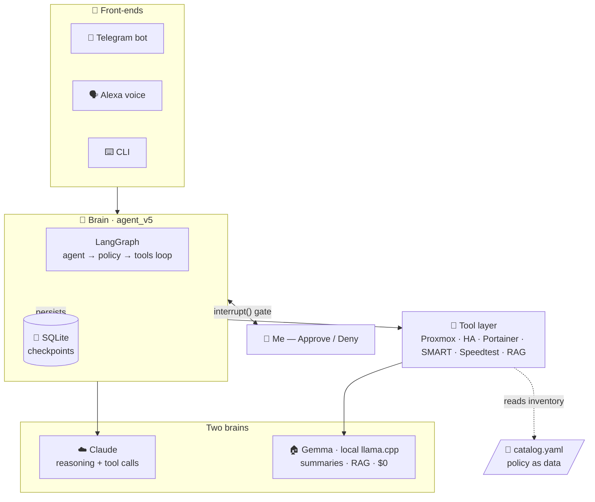
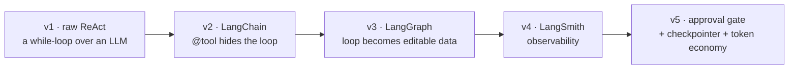
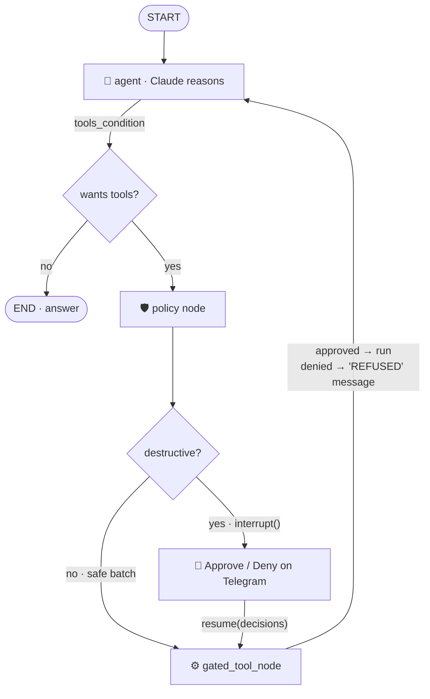

# 🛰️ HomelabSentinel

### An agentic-AI Site Reliability Engineer for my homelab

*Talk to your infrastructure in plain English. An LLM reasons over live
Proxmox · Home Assistant · Docker state — and asks permission before it
changes anything.*

> 📦 **This page is a showcase.** The complete, runnable project — all source,
> diagrams, and a file-by-file teaching guide — lives in its own repository:
> ### → **[github.com/naveen6gowda/AI-Agent ↗](https://github.com/naveen6gowda/AI-Agent)**

---

HomelabSentinel is a **production agentic-AI system** running 24/7 on an
unprivileged Proxmox LXC. I ask it *"are my backups OK?"* or *"restart Immich"*
over **Telegram** or **Alexa**, and it reasons with an LLM: it picks tools,
gathers live data from Proxmox / Home Assistant / Portainer, decides whether an
action is needed, and **stops at a human-approval gate before touching anything.**

It started as a learning exercise (a raw, framework-free tool-loop) and grew into
the real on-call agent for my homelab — engineered around two constraints every
homelabber has: **don't let the AI break things**, and **don't run up a cloud bill.**

---

## 🏗️ Architecture

---

## ✨ What it demonstrates

| Capability | How |
|---|---|
| 🛡️ **Human-in-the-loop safety** | A LangGraph `interrupt()` gate pauses every destructive tool call for my tap on Telegram. **Default-deny** — timeout/error/silence = no. |
| 🧠 **Cost-aware multi-model routing** | Cloud **Claude** reasons; a **local Gemma** (llama.cpp) does cheap summaries. Monitors + ~95% of voice run **offline at $0**. |
| 💾 **Durable, resumable agents** | A SQLite checkpointer persists graph state across the interrupt — approve after dinner, survive a process restart mid-decision. |
| 🧱 **Defense in depth** | 8 independent safety layers, from catalog policy (`restart_policy: never`) to per-action auth boundaries. |
| 🔌 **One brain, three front-ends** | CLI, Telegram bot, Alexa voice — via a dependency-injected approval function. Voice is **read-only by construction**. |
| 🔎 **Local RAG** | BM25 lexical search over my markdown runbooks answers *"how do I…"* at **zero Claude tokens**. |
| 📡 **Headless monitoring** | 6 `systemd` timers (reachability, docker, speedtest, SMART, backups, energy) that alert on Telegram only when something is wrong. |

---

## 📈 Built as a five-step course (v1 → v5)

The five `agent_v*` files solve the **same task** five times — each adds exactly
one production concern. It's the clearest way I know to show *how an agent
actually works* under the framework sugar.

| Version | Adds | The lesson |
|:--:|---|---|
| **v1** | The bare ReAct loop (raw Anthropic API) | An agent is a `while` loop over an LLM with tools |
| **v2** | The `@tool` decorator + `create_agent` | The framework just *hides* the loop |
| **v3** | An explicit `StateGraph` | The loop becomes **editable data** |
| **v4** | LangSmith tracing | You can't operate what you can't see |
| **v5** | **Approval gate + checkpointer + token economy** | Editable graph → insert a human gate |

---

## 🔒 The approval gate (the heart of v5)

v3's wiring was `agent → tools`. v5 inserts a `policy` node that pauses the whole
graph the instant a destructive tool is requested:

A denial isn't an exception — it's a synthetic `ToolMessage` fed back to Claude
saying *"REFUSED by operator."* On its next turn the model reasons about the
refusal instead of blindly retrying. The read-only **voice** path reuses the
exact same graph, just with an approval function that always denies — so it's
*physically incapable* of a destructive action, with no separate "read-only mode."

### Defense in depth — a destructive action must survive all 8 layers

| # | Layer | Mechanism |
|:--:|---|---|
| 0 | Catalog policy | `restart_policy: never` ⇒ the tool is never even proposed |
| 1 | System-prompt rules | "check status before restarting"; distrust ballooned VM memory |
| 2 | Read-before-write | must call `check_*` before any destructive tool |
| 3 | `policy_node` gate | `interrupt()` — the hard, code-level stop |
| 4 | Human approval | my physical tap, per action; default-deny |
| 5 | `gated_tool_node` | denied id ⇒ tool never runs |
| 6 | Audit trail | every ask + execution logged to `audit.log` *and* the chat |
| 7 | Auth boundaries | bot allow-list · scoped Proxmox token · voice read-only |
| 8 | Blast-radius limits | loop bound · tools return dicts not exceptions · token caps |

---

## 🛠️ Tech stack

`Python 3.14` · `LangGraph` · `LangChain` · `Anthropic Claude` ·
`llama.cpp` (local Gemma) · `FastAPI` · `Pydantic v2` · SQLite checkpointer ·
`systemd` · Proxmox API · Home Assistant API · Portainer · Telegram Bot API · BM25 RAG

---

**The complete project — every file, the diagrams above in context, and a
full teaching guide:**

### → [github.com/naveen6gowda/AI-Agent ↗](https://github.com/naveen6gowda/AI-Agent)

