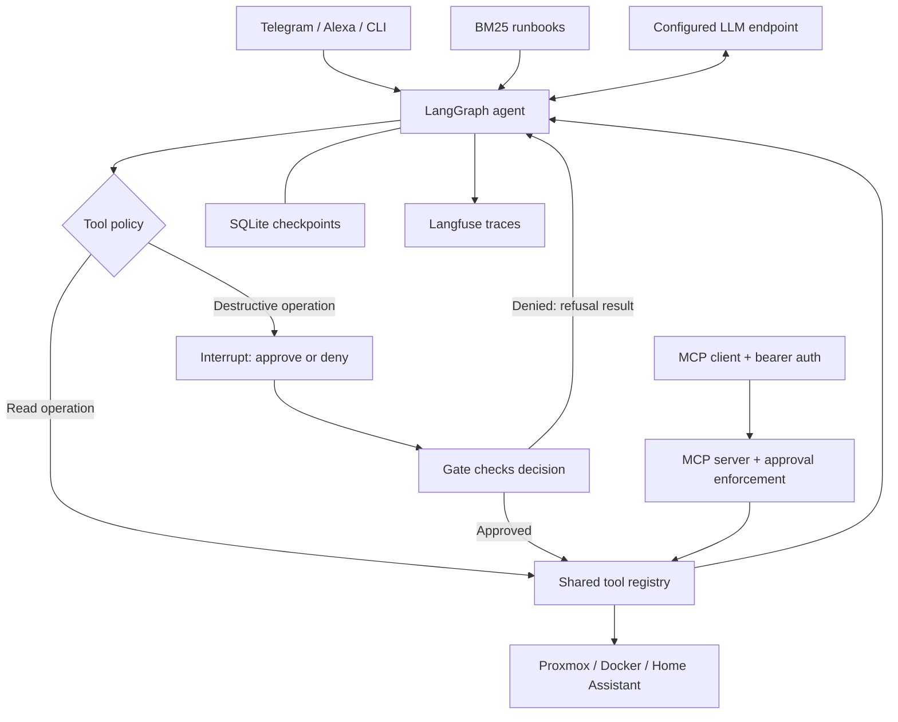

[← Portfolio](../../README.md) · [AI examples](../README.md)

# HomelabSentinel

**A LangGraph agent for infrastructure operations, with human approval at the tool boundary.**

Independent project · June 2025–Present · Python, LangGraph, FastAPI, Pydantic, SQLite

[Source repository](https://github.com/naveen6gowda/AI-Agent/tree/main/Agent_AI) · [Architecture](https://github.com/naveen6gowda/AI-Agent/blob/main/Agent_AI/docs/ARCHITECTURE.md) · [Tests](https://github.com/naveen6gowda/AI-Agent/tree/main/Agent_AI/tests) · [Evaluations](https://github.com/naveen6gowda/AI-Agent/tree/main/Agent_AI/evals)

## Problem and contribution

Checking several infrastructure dashboards is repetitive, but allowing an LLM to restart services without review introduces operational risk. I built Sentinel to combine status checks and runbook context in a conversational interface, with an explicit approval step for destructive tools.

My work covers the agent graph, infrastructure clients, shared registry, approval and checkpoint flow, MCP interface, monitoring integrations, retrieval, tracing, and evaluation. The public implementation is maintained in **AI-Agent**; this folder provides the portfolio case study.

## Architecture

## Capabilities and evidence

| Capability | Implementation / evidence |
|---|---|
| One tool catalog | [29-tool registry](https://github.com/naveen6gowda/AI-Agent/blob/main/Agent_AI/registry.py) shared by agent, MCP, and policy logic |
| Human approval | LangGraph interrupt/resume, default-deny decisions, per-action gating, and audit records |
| Persistent interaction | SQLite checkpoints retain conversational state across interruptions |
| MCP access | [Streamable HTTP server](https://github.com/naveen6gowda/AI-Agent/blob/main/Agent_AI/mcp_server.py), bearer authentication, and server-side approval checks |
| Retrieval | BM25 runbook search and retrieval of saved operational context |
| Observability | Self-hosted Langfuse traces for model/tool behavior and debugging |
| Infrastructure monitoring | Service-failure alerts, internet-speed monitoring, and deterministic fallbacks when model summarization is unavailable |
| Model handling | Configurable inference endpoints, runtime probing, and fallback handling |
| Interfaces | Telegram interaction, Alexa voice access, and CLI operation |
| Public release | Sanitized source mirror; private credentials and deployment data are excluded |

## Approval design

The graph routes tool requests through policy before execution. Destructive actions require an explicit decision; denial is returned as a tool result so the agent can respond to it. The voice path denies destructive requests.

The implementation combines catalog restrictions, read-before-write checks, the interrupt gate, per-action approval, execution checks, audit logging, authentication boundaries, and bounded agent loops. Prompt instructions help guide behavior; enforcement depends on the code and deployment configuration.

## Validation and an observed limitation

- **40+ pytest tests** cover clients, policy, MCP, evaluation mechanics, and utilities. [GitHub Actions](https://github.com/naveen6gowda/AI-Agent/blob/main/.github/workflows/ci.yml) runs the automated tests.
- **12 golden scenarios** exercise agent behavior against a live model through a separate local evaluation harness. Live model evaluations are **not** run by the CI workflow.
- A quantization-related tool-ordering regression is explicitly recorded as `known_fail` in the [golden scenario file](https://github.com/naveen6gowda/AI-Agent/blob/main/Agent_AI/evals/golden.yaml). This is useful evidence of a limitation, not a claim that every scenario passes.

These counts refer to the public source snapshot [51f402d](https://github.com/naveen6gowda/AI-Agent/commit/51f402d796888f901bf359103d35c626c45641d4), reviewed in September 2026. Test presence does not establish universal model reliability or service uptime.

## Local inference and data boundaries

The homelab has used Ollama, llama.cpp, and LM Studio. Local inference can keep model processing on owned hardware, while Telegram, Alexa, weather APIs, and optional cloud providers introduce external dependencies. Privacy, latency, and cost depend on the selected provider, enabled integrations, hardware, and workload.

## Evolution and reproduction

The [legacy implementations](https://github.com/naveen6gowda/AI-Agent/tree/main/Agent_AI/legacy) preserve the progression from a raw tool loop to LangChain, explicit LangGraph wiring, tracing, and the approval-gated design. They show how the architecture evolved.

For installation, environment variables, service credentials, and test commands, use the [implementation README](https://github.com/naveen6gowda/AI-Agent/blob/main/Agent_AI/README.md) and [project configuration](https://github.com/naveen6gowda/AI-Agent/blob/main/Agent_AI/pyproject.toml). Running the integration requires your own infrastructure endpoints and credentials; nothing in this Portfolio folder deploys the agent.
