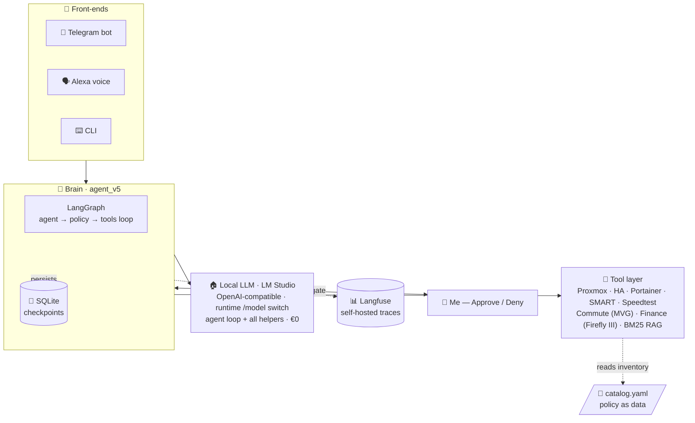
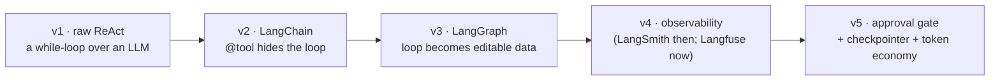
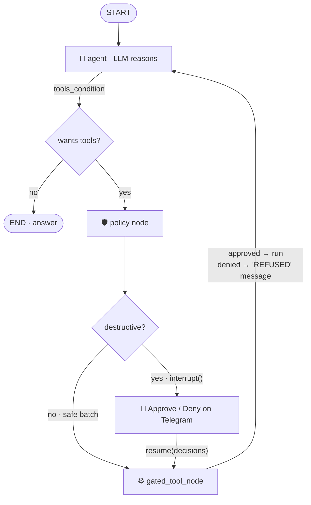

# 🛰️ HomelabSentinel

### An agentic-AI Site Reliability Engineer for my homelab

*Talk to your infrastructure in plain English. An LLM reasons over live
Proxmox · Home Assistant · Docker state — and asks permission before it
changes anything. 100% local inference.*

> 📦 **This page is a showcase.** The complete, runnable project — all source,
> diagrams, and a file-by-file teaching guide — lives in its own repository:
> ### → **[github.com/naveen6gowda/AI-Agent ↗](https://github.com/naveen6gowda/AI-Agent)**

---

HomelabSentinel is a **production agentic-AI system** running 24/7 on an
unprivileged Proxmox LXC. I ask it *"are my backups OK?"* or *"restart Immich"*
over **Telegram** or **Alexa**, and it reasons with an LLM: it picks tools,
gathers live data from Proxmox / Home Assistant / Portainer, decides whether an
action is needed, and **stops at a human-approval gate before touching anything.**

It started as a learning exercise (a raw, framework-free tool-loop) and grew into
the real on-call agent for my homelab — engineered around two constraints every
homelabber has: **don't let the AI break things**, and **don't ship your home to
the cloud.** Since the July 2026 redesign, every token of inference is served by
**one local model**, and every trace lands in **self-hosted Langfuse**.

---

## 🏗️ Architecture

---

## ✨ What it demonstrates

| Capability | How |
|---|---|
| 🛡️ **Human-in-the-loop safety** | A LangGraph `interrupt()` gate pauses every destructive tool call for my tap on Telegram. **Default-deny** — timeout/error/silence = no. |
| 🏠 **100% local, cost-aware inference** | One model served by **LM Studio** (OpenAI-compatible) powers the agent loop *and* every helper. Marginal cost **€0**; runtime `/model` switching with **probe-before-switch**. |
| 📊 **LLM observability** | Every agent run, tool call, and token count traced in **self-hosted Langfuse** — chosen over LangSmith so traces never leave home. |
| 💾 **Durable, resumable agents** | A SQLite checkpointer persists graph state across the interrupt — approve after dinner, survive a process restart mid-decision. |
| 🧱 **Defense in depth** | 8 independent safety layers, from catalog policy (`restart_policy: never`) to per-action auth boundaries. |
| 🚨 **The watcher is watched** | Every systemd unit carries an `OnFailure=` hook that pages me on Telegram with the journal tail; a nightly retention job prunes the checkpoint DB (a lesson learned at **274 MB**). |
| 🔌 **One brain, three front-ends** | CLI, Telegram bot, Alexa voice — via a dependency-injected approval function. Voice is **read-only by construction**. |
| 🌐 **MCP server** | **`sentinel-mcp`** serves the agent's whole 29-tool registry to any MCP client (Claude Code / Desktop, other agents) over **streamable HTTP + bearer auth**. The approval gate is enforced **server-side** — an external AI's destructive call still lands as an Approve/Deny card on my phone, default-deny on timeout. |
| 🧪 **Agent evals** | A **12-scenario golden harness** replays real ops questions and scores tool selection + answers. It caught an over-quantized model variant degrading tool-call ordering — tracked as an explicit `known_fail`. |
| ✅ **Tests + CI** | **40+ pytest tests** (policy gate, MCP auth, tool clients) run on GitHub Actions on every push — including a regression test for a default-deny bug the suite itself found. |
| 🔎 **Local RAG** | BM25 lexical search over my markdown runbooks answers *"how do I…"* fully offline — and conversation memory is distilled into RAG notes **before** checkpoint retention prunes it. |
| 📡 **Headless monitoring** | **8 `systemd` timers** — reachability, Docker, SMART, WAN speed, backups, energy, an **MVG commute guard** (departures → Alexa), and nightly DB maintenance — plus a **finance bridge** that turns bank-app notifications into Firefly III draft transactions. Alerts only when something is wrong. |

---

## 📈 Built as a five-step course (v1 → v5)

The five `agent_v*` files solve the **same task** five times — each adds exactly
one production concern. They're now archived in
[`legacy/` ↗](https://github.com/naveen6gowda/AI-Agent/tree/main/Agent_AI/legacy)
(v5 is the production agent), and they're still the clearest way I know to show
*how an agent actually works* under the framework sugar.

| Version | Adds | The lesson |
|:--:|---|---|
| **v1** | The bare ReAct loop (raw provider API) | An agent is a `while` loop over an LLM with tools |
| **v2** | The `@tool` decorator + `create_agent` | The framework just *hides* the loop |
| **v3** | An explicit `StateGraph` | The loop becomes **editable data** |
| **v4** | Tracing (LangSmith then; **self-hosted Langfuse** in production today) | You can't operate what you can't see |
| **v5** | **Approval gate + checkpointer + token economy** | Editable graph → insert a human gate |

---

## 🔒 The approval gate (the heart of v5)

v3's wiring was `agent → tools`. v5 inserts a `policy` node that pauses the whole
graph the instant a destructive tool is requested:

A denial isn't an exception — it's a synthetic `ToolMessage` fed back to the
model saying *"REFUSED by operator."* On its next turn the model reasons about
the refusal instead of blindly retrying. The read-only **voice** path reuses the
exact same graph, just with an approval function that always denies — so it's
*physically incapable* of a destructive action, with no separate "read-only mode."

### Defense in depth — a destructive action must survive all 8 layers

| # | Layer | Mechanism |
|:--:|---|---|
| 0 | Catalog policy | `restart_policy: never` ⇒ the tool is never even proposed |
| 1 | System-prompt rules | "check status before restarting"; distrust ballooned VM memory |
| 2 | Read-before-write | must call `check_*` before any destructive tool |
| 3 | `policy_node` gate | `interrupt()` — the hard, code-level stop |
| 4 | Human approval | my physical tap, per action; default-deny |
| 5 | `gated_tool_node` | denied id ⇒ tool never runs |
| 6 | Audit trail | every ask + execution logged to `audit.log` *and* the chat |
| 7 | Auth boundaries | bot allow-list · scoped Proxmox token · voice read-only |
| 8 | Blast-radius limits | loop bound · tools return dicts not exceptions · token caps |

---

## 📐 The roadmap — planned in the open, then shipped

[`docs/ARCHITECTURE.md` ↗](https://github.com/naveen6gowda/AI-Agent/blob/main/Agent_AI/docs/ARCHITECTURE.md)
started as an honest review of the architecture (including what was wrong with
it) and a phased roadmap. **Every phase is now in production:**

| Phase | Shipped |
|---|---|
| 🧰 One tool registry | [`registry.py` ↗](https://github.com/naveen6gowda/AI-Agent/blob/main/Agent_AI/registry.py) — 29 tools declared once; agent, MCP server, and policy gate share one source of truth |
| 🌐 `sentinel-mcp` MCP server | [`mcp_server.py` ↗](https://github.com/naveen6gowda/AI-Agent/blob/main/Agent_AI/mcp_server.py) — streamable HTTP + bearer auth, **server-side approval enforcement** |
| 🧪 Evaluation harness | [`evals/` ↗](https://github.com/naveen6gowda/AI-Agent/tree/main/Agent_AI/evals) — 12 golden scenarios; already caught a quantization regression (`known_fail`) |
| ✅ Tests + CI | [`tests/` ↗](https://github.com/naveen6gowda/AI-Agent/tree/main/Agent_AI/tests) — 40+ pytest tests on GitHub Actions |
| 🔒 Sanitizing public mirror | Private repo → scrub + secret scan → public mirror; caught a real `.env.bak` pre-publish |
| 🛡️ Resilience | LLM fallback chain + memory-before-prune (history → RAG before retention deletes it) |

---

## 🛠️ Tech stack

`Python 3.14` · `LangGraph` · `LangChain` · **MCP (streamable HTTP)** ·
**local LLM via LM Studio** (OpenAI-compatible, runtime model switching) ·
**Langfuse** (self-hosted) · `FastAPI` · `Pydantic v2` · SQLite checkpointer ·
`pytest` + GitHub Actions CI · `systemd` · Proxmox API · Home Assistant API ·
Portainer · Telegram Bot API · Firefly III · BM25 RAG

---

**The complete project — every file, the diagrams above in context, and a
full teaching guide:**

### → [github.com/naveen6gowda/AI-Agent ↗](https://github.com/naveen6gowda/AI-Agent)

