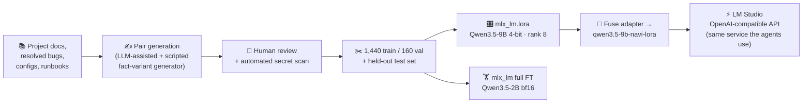

# LLM Fine-Tuning — Qwen3.5 on Apple Silicon (MLX)

> 🧬 **LoRA/QLoRA + full-parameter fine-tuning, entirely local — dataset engineering, training, evaluation, and deployment of the tuned model into my own inference service. €0 in cloud compute.**

The goal: make a small local model answer questions about **my** infrastructure —
the ESP32 fleet, the PCB design rules, the Proxmox/OPNsense topology, the agent
platforms — the way I would, with the hard-won details that only exist in my
project notes. Every step ran on a MacBook M4 Pro (24 GB unified memory) with
[MLX](https://github.com/ml-explore/mlx) / `mlx-lm`. No cloud GPU, no API.

Two training regimes on the same dataset, deliberately, to learn the trade-offs
first-hand:

| Run | Base model | Method | Key config |
|---|---|---|---|
| **LoRA (QLoRA-style)** | `Qwen3.5-9B` (MLX **4-bit**) | Adapters on a quantized base | rank 8 · top 13 of 32 blocks · lr 1e-5 · seq 2048 · batch 1 |
| **Full fine-tune** | `Qwen3.5-2B` (**bf16**) | Full-weight updates | 16 of 24 blocks unfrozen · lr 5e-6 · 1,400 iters · gradient checkpointing |

The 9B QLoRA run trains adapters on top of 4-bit quantized weights — peak
training memory stays around 10–12 GB, comfortable on a 24 GB machine. The full
fine-tune needs bf16 weights **plus** optimizer state per parameter, which is
why it runs on the 2B model with gradient checkpointing: same dataset, ~10× the
trainable parameters per layer, and a much smaller learning rate because full
updates move the model far more aggressively than adapters do.

---

## 📊 The dataset is the project

Fine-tuning quality is decided in the dataset, not in the training flags. I
built **1,600 instruction pairs** (chat-format JSONL) from my own project
documentation and resolved-bug history — then reviewed them.

- **20 topic batches** — ESP32-C6 deep-sleep lessons, ESPHome fleet, KiCad/HV
  design rules, CM5 carrier board, India compliance (WPC/BIS), Proxmox +
  backups, VLANs/OPNsense, Home Assistant automations, the Sentinel and Hermes
  agent platforms, LM Studio serving, ops runbooks, and more.
- **Deliberate question-style variety** — direct facts, quick-fire (IPs, ports,
  part numbers), troubleshooting scenarios, true/false misconception
  corrections, "why X over Y" decision records, config/YAML-writing tasks,
  command cookbook, cross-domain traces, timelines.
- **Generalization by design** — core facts are phrased 2–3 different ways so
  the model learns the fact, not the sentence.
- **Bilingual** — ~45 German-language pairs matching my voice-first bilingual
  workflow.
- **Sanitized, and verified** — an automated scan over all 1,600 pairs confirms
  no tokens, passwords, chat IDs, or credentials of any kind; answers reference
  *where* secrets live, never their values.
- **Split with discipline** — 1,440 train / 160 validation (seeded shuffle),
  plus a held-out test set that never enters training — including an
  off-domain control question to catch catastrophic forgetting.

*(The dataset itself stays private — it intentionally encodes internal
hostnames and addresses. What's public here is the method.)*

---

## 🔁 Pipeline

Training runs with `mlx_lm.lora` (which also drives full fine-tuning via
`--fine-tune-type full`), checkpointing adapters every 100 iterations and
reporting validation loss throughout — watched for the overfit turn (train
loss falling while val loss rises).

---

## 🚀 Deployment — closing the loop

The tuned LoRA was **fused into a standalone model**
(`qwen3.5-9b-navi-lora`) and dropped into the same **LM Studio** instance that
serves every agent in the lab — so the fine-tuned model is available through
the identical OpenAI-compatible, bearer-authenticated API as the production
35B model, switchable at runtime. Training → evaluation → serving, one
self-hosted loop.

---

## 🧠 What this demonstrates

- **Dataset engineering** — sourcing, style variety, paraphrase-for-
  generalization, bilingual coverage, sanitization with verification, and
  clean train/val/test hygiene.
- **Practical fine-tuning trade-offs** — QLoRA on a quantized 9B vs.
  full-parameter on a bf16 2B, chosen from actual memory math on 24 GB of
  unified memory (gradient checkpointing, layer freezing, learning-rate
  scaling between regimes).
- **Local-first ML engineering** — the whole train/eval/deploy cycle on
  consumer hardware with MLX, ending in a production-serving endpoint, not a
  notebook.
