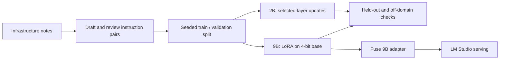

[← Portfolio](../../README.md) · [AI projects](../README.md)

# Qwen adaptation on Apple Silicon

**A domain-specific LLM training experiment within a 24 GB unified-memory budget.**

Independent project · MLX / MLX-LM · MacBook M4 Pro · Qwen3.5

## Goal and contribution

I wanted a local model to answer questions about my infrastructure and operating procedures more consistently. I prepared and reviewed instruction data, configured two training approaches, and fused the 9B LoRA adapter for serving through LM Studio's OpenAI-compatible API.

This is an experiment write-up. The dataset, trained weights, and run logs remain private; this repository does not provide an independently reproducible benchmark or a training package.

## Dataset and evaluation approach

- **1,600 instruction pairs**, covering **20 infrastructure topics**, including roughly 45 German examples alongside English examples.
- LLM-assisted and scripted data preparation followed by human review and secret scanning.
- Seeded **1,440 / 160 training-validation split**, with additional held-out prompts and off-domain control questions used to examine generalization and possible forgetting.
- Infrastructure-specific data is private. No accuracy improvement, loss curve, or comparative benchmark is claimed without published results.

## Training configurations

| Setting | Qwen3.5-9B adaptation | Qwen3.5-2B adaptation |
|---|---|---|
| Base representation | 4-bit quantized | BF16 |
| Method | LoRA on a quantized base / QLoRA-style adaptation | Selected-layer weight updates |
| Updated layers | LoRA rank 8 across 13 of 32 blocks | 16 of 24 blocks unfrozen |
| Learning rate | `1e-5` | `5e-6` |
| Other recorded settings | Sequence length 2,048; batch size 1 | 1,400 iterations; gradient checkpointing |
| Serving outcome | Adapter fused and served through LM Studio | Separate training experiment |

The 2B run used MLX-LM's `--fine-tune-type full` mode with only selected layers unfrozen. It was **not full-parameter fine-tuning of every model weight**.

## Workflow

## Engineering decisions

A quantized base and low-rank adapters reduced the memory required for the larger model. The smaller BF16 model offered a second way to explore domain adaptation by updating selected base-model layers. Gradient checkpointing traded compute for memory in that run.

The experiment strengthened my work on dataset curation, train/validation separation, LoRA configuration, memory-constrained training, model export, and the boundary between a promising local result and a reproducible evaluation claim.

[Related: Sentinel case study](../Agent_AI/README.md) · [Local inference history](../ollama-lxc-setup.md)
