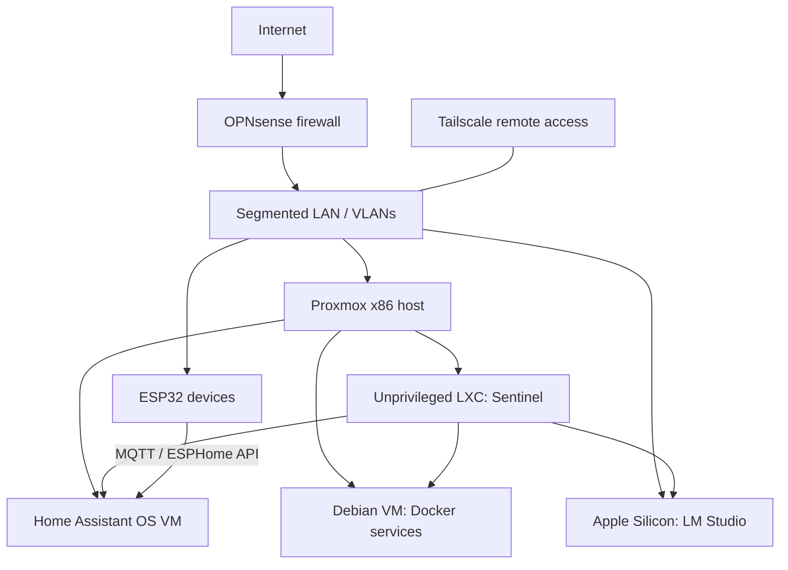

[← Portfolio](../README.md) · [Docker services](../docker/README.md) · [Embedded devices](../esphome/README.md)

# Homelab infrastructure

**A personal environment for operating AI applications, services, and connected devices.**

I configured the virtualization, networking, service deployment, and Home Assistant integrations that support these projects. This page records the portfolio architecture; it is not a live inventory or uptime dashboard.

## Architecture

## Components and responsibility

| Component | Role in the projects |
|---|---|
| Proxmox on an x86 mini PC | VM and LXC provisioning; documented host configuration: four CPU cores and 16 GB RAM |
| OPNsense and VLANs | Routing, firewall rules, and separation of infrastructure and IoT networks |
| Home Assistant OS | Device entities, automations, dashboards, and voice integration |
| Debian Docker VM | Application services, persistent volumes, service logs, and backup tooling |
| Sentinel LXC | Python agent, scheduled monitoring, failure alerts, and infrastructure clients |
| Apple Silicon inference node | LM Studio serving through an OpenAI-compatible API |
| Tailscale | Remote access without requiring inbound port forwarding for those connections |
| ESP32 devices | Sensors, displays, MQTT telemetry, and Home Assistant API integration |

## Inference evolution

1. **Ollama:** initial model management and local inference, alongside an OpenClaw deployment.
2. **llama.cpp / Vulkan:** direct GGUF configuration and iGPU acceleration in LXC; experimentation with Hermes Agent as a separately developed agent framework.
3. **LM Studio / Apple Silicon:** a later serving configuration shared by Sentinel and other clients. The July 2026 project notes used a Qwen3.6-35B MoE model; model selection is configurable and may change.

[Earlier LXC configuration and design decisions](../ai/ollama-lxc-setup.md)

## Operations and automation

The work includes systemd-based monitoring, internet-speed checks, service-failure notifications, Langfuse tracing, and deterministic fallbacks when an LLM is unavailable. n8n workflows support a daily AI news briefing and Telegram assistance. These workflows are described as project experience; their private workflow exports are not included here.

For application layout and configuration prerequisites, see the [24-service Compose reference](../docker/README.md). For sensors and voice interfaces, see the [nine ESPHome configurations](../esphome/README.md).

## Data and deployment boundaries

Local inference and self-hosted storage provide control over where those parts run. Telegram, Alexa, external data APIs, and optional cloud model providers still have their own network and data flows. Performance depends on model size, quantization, hardware, and load; this portfolio does not claim zero latency, zero operating cost, or fully offline operation for every integration.
